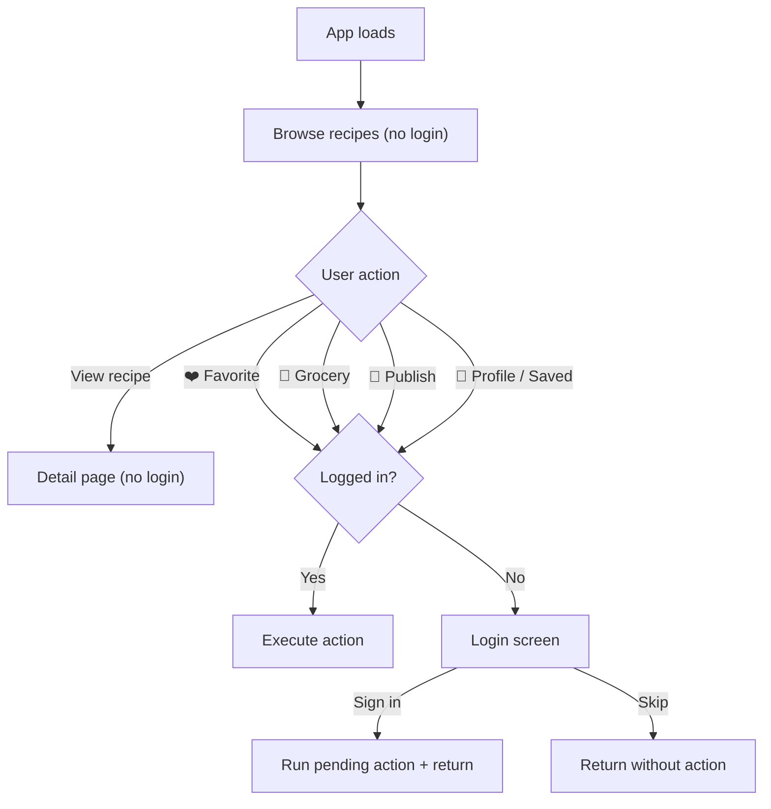

# Auth System — Walkthrough

## What Changed

| File | Change |
|---|---|
| [index.ts](file:///c:/Users/Aiman/OneDrive/Documents/Let-Em-Cook/recipe-app/src/types/index.ts) | Added `LOGIN`, `SIGNUP` to Screen enum |
| [AuthScreen.tsx](file:///c:/Users/Aiman/OneDrive/Documents/Let-Em-Cook/recipe-app/src/pages/AuthScreen.tsx) | **New** — Login/signup with glassmorphism, Google/Facebook buttons, forgot password |
| [useAuth.ts](file:///c:/Users/Aiman/OneDrive/Documents/Let-Em-Cook/recipe-app/src/hooks/useAuth.ts) | Added `signInWithGoogle`, `signInWithFacebook`, `resetPassword` |
| [App.tsx](file:///c:/Users/Aiman/OneDrive/Documents/Let-Em-Cook/recipe-app/src/App.tsx) | `requireAuth()` gating, pending action system, auth screen routing |
| [supabase.ts](file:///c:/Users/Aiman/OneDrive/Documents/Let-Em-Cook/recipe-app/src/lib/supabase.ts) | Removed debug console.logs |

## Auth Flow

## Verification

- ✅ TypeScript compiles with zero errors
- ✅ Vite HMR updates successfully
- ✅ Dev server running at `http://localhost:3000`

## Next Steps for You

1. **Test the login flow** — try favoriting a recipe (it should redirect to login)
2. **Enable email auth** — in Supabase Dashboard → Authentication → make sure Email provider is enabled
3. **Google OAuth** *(optional)* — set up at Google Cloud Console → paste credentials in Supabase → Auth → Providers → Google
4. **Facebook OAuth** *(optional)* — set up at Facebook Developers → paste in Supabase → Auth → Providers → Facebook
